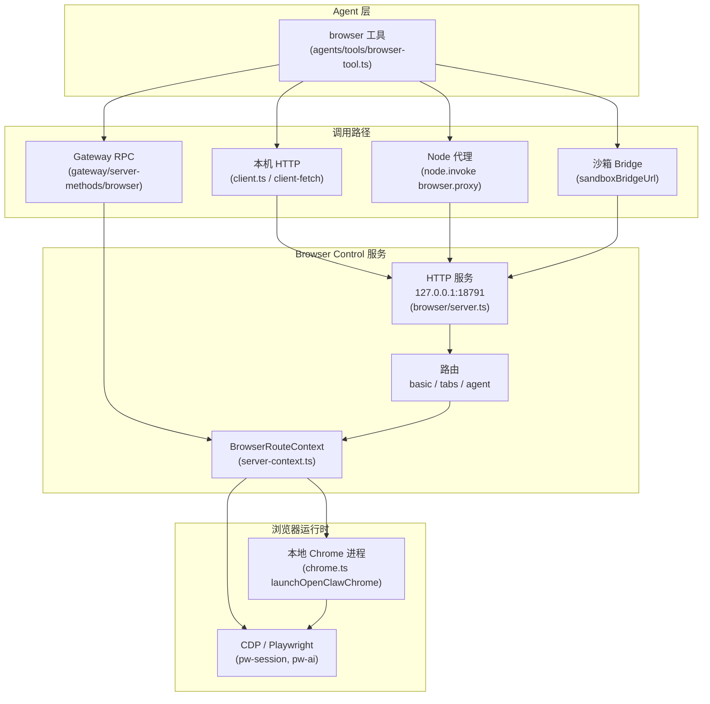
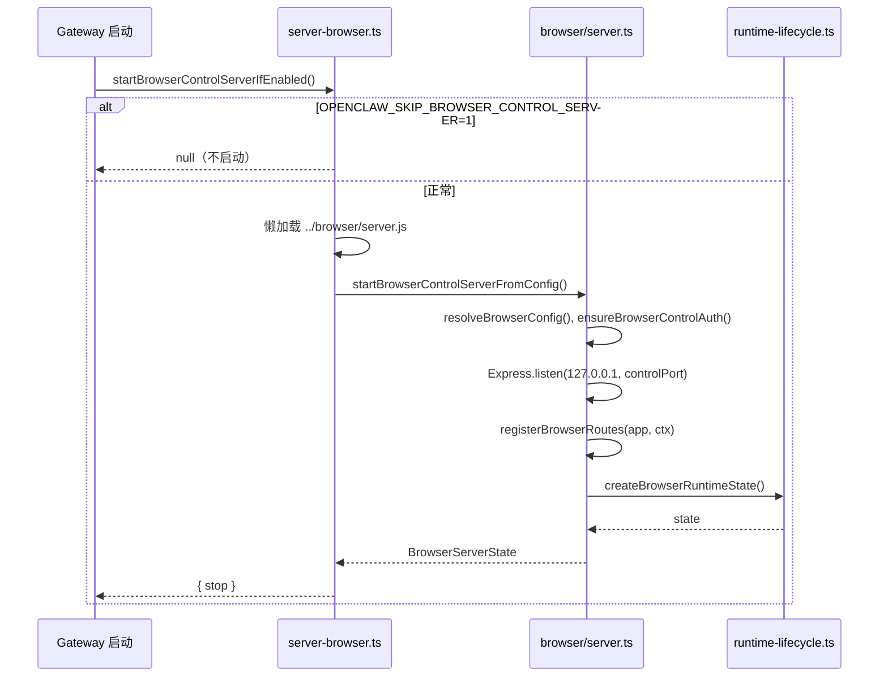
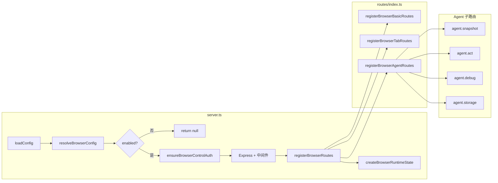
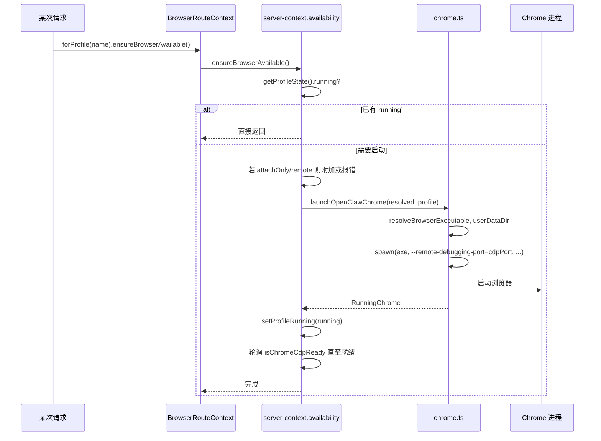
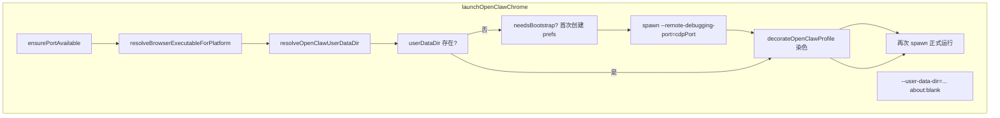
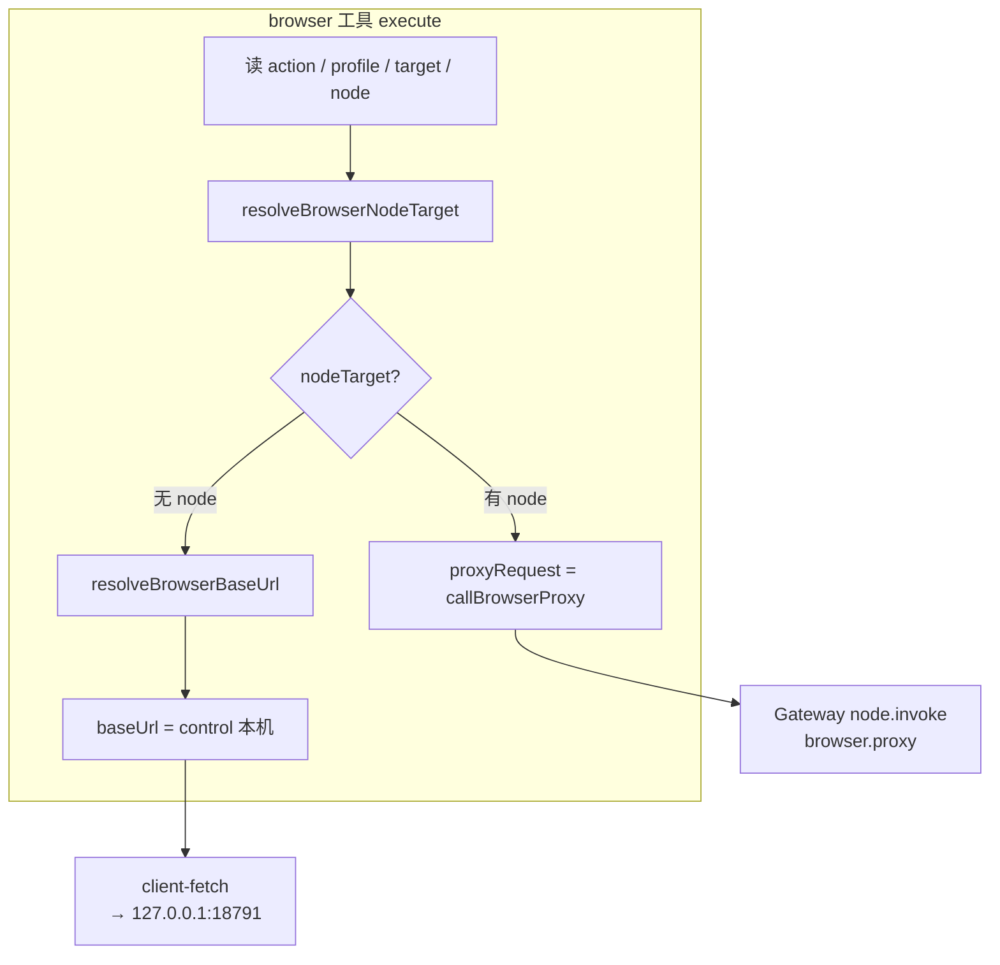
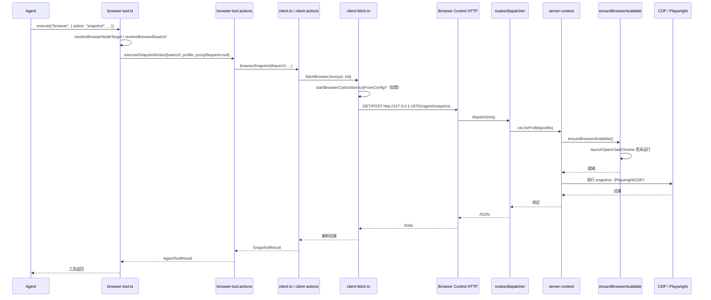
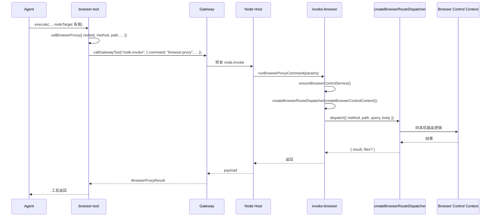

# OpenClaw 本地浏览器架构与代码逻辑

本文档梳理 OpenClaw 如何使用本地浏览器：从 Gateway 启动 Browser Control 服务，到按需启动 Chrome、经 CDP/Playwright 执行操作，再到 Agent 工具 `browser` 的调用链。

---

## 一、整体架构

---

## 二、启动链路

### 2.1 Gateway 是否启动 Browser Control

### 2.2 Browser Control 服务与路由

---

## 三、本地 Chrome 启动与 CDP

### 3.1 按需启动 Chrome

### 3.2 Chrome 启动内部流程（chrome.ts）

---

## 四、Agent 工具 browser 调用链

### 4.1 工具执行与目标解析

### 4.2 本机 Host 请求完整链路

### 4.3 经 Node 代理的请求

---

## 五、关键文件索引

| 角色                          | 路径                                                               |
| ----------------------------- | ------------------------------------------------------------------ |
| Gateway 是否启动 browser 控制 | `src/gateway/server-browser.ts`                                    |
| Browser HTTP 服务（完整）     | `src/browser/server.ts`                                            |
| Browser 仅服务状态（无 HTTP） | `src/browser/control-service.ts`                                   |
| 路由注册与 Context            | `src/browser/routes/index.ts`、`src/browser/server-context.ts`     |
| 按 profile 保证浏览器可用     | `src/browser/server-context.availability.ts`                       |
| 停止所有 profile              | `src/browser/server-lifecycle.ts`                                  |
| 启动本地 Chrome 进程          | `src/browser/chrome.ts`（`launchOpenClawChrome`）                  |
| Tab / 打开页面（CDP）         | `src/browser/server-context.tab-ops.ts`                            |
| Agent 用 snapshot/act 等 API  | `src/browser/routes/agent.ts`、`agent.snapshot.ts`、`agent.act.ts` |
| 工具 "browser" 定义与执行     | `src/agents/tools/browser-tool.ts`、`browser-tool.actions.ts`      |
| 本机发 HTTP 到 control        | `src/browser/client.ts`、`src/browser/client-fetch.ts`             |
| Node 上执行 browser.proxy     | `src/node-host/invoke-browser.ts`                                  |
| Gateway 侧 RPC 转 browser     | `src/gateway/server-methods/browser.ts`                            |

---

## 六、配置与端口

- **Browser Control 端口**：由 `gateway.port` 推导（默认 `18791`，即 gateway + 2），见 `src/config/port-defaults.ts`。
- **CDP 端口**：每 profile 可配 `cdpPort`（如 openclaw 默认 `18800`），或远程 `cdpUrl`。
- **启用/禁用**：`browser.enabled` 为 `false` 时，不启动 Control 服务，工具会报 "browser control disabled"。

---

_文档基于当前 main 分支代码整理，用于理解 OpenClaw 本地浏览器的代码逻辑与数据流。_
